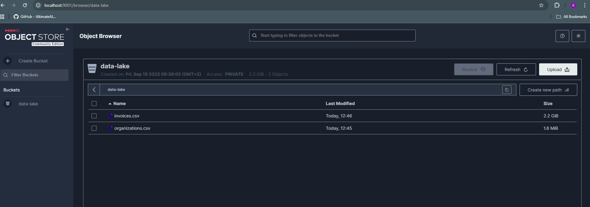
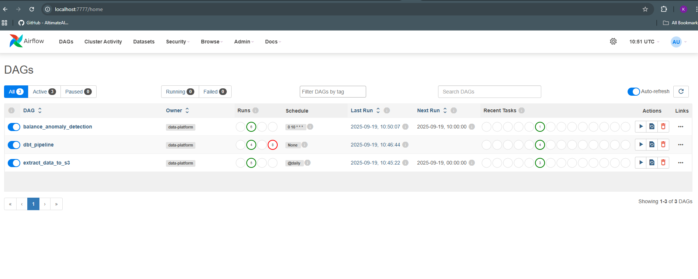
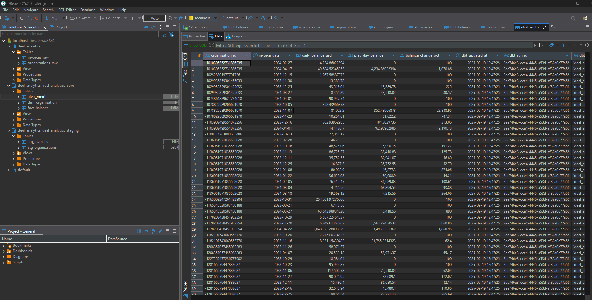
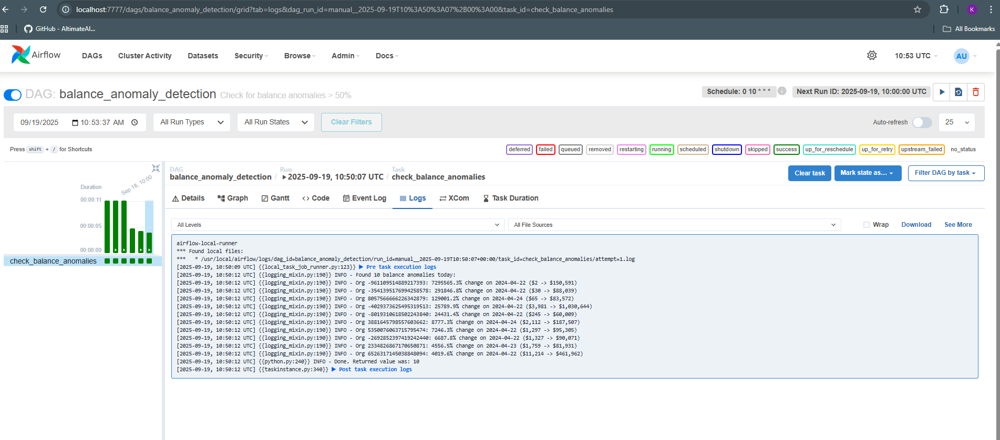

# Deel Data Platform

Simple data pipeline that alerts when customer balance changes > 50% day over day.

## What it does

1. **Extract**: Uploads CSV files to MinIO (data lake)
2. **Load**: Load Data into Clickhouse(warehouse) as external tables from data lake
2. **Transform**: DBT models clean data and calculate balance changes
3. **Alert**: Airflow DAG checks for anomalies and prints alerts

## Business Logic assumption

**Balance Calculation**: Only uses invoices with status `credited` and `refunded`:
- `credited` invoices: Positive amounts (add to balance)
- `refunded` invoices: Negative amounts (subtract from balance)
- Other statuses (`paid`, `pending`, `failed`, etc.) are ignored for balance calculations

This gives us the actual account balance changes, not just payment statuses.

## Setup

1. **Add input files**: Place your CSV files in `airflow/input-files/` directory
2. **Start services**:
```bash
# start everything
docker-compose up -d

# check if it's running
docker-compose ps
```

## DAGs

- `extract_data_to_s3`: Uploads CSVs to MinIO, creates ClickHouse external tables
- `dbt_pipeline`: Runs DBT models (staging -> core -> alerts)
- `balance_anomaly_detection`: Checks for balance changes > 50%

## Data Flow

```
CSV files -> MinIO -> ClickHouse external tables -> DBT staging -> DBT core -> Alert table
```

## Project Structure

**Core Solution Files:**
- `airflow/dags/` - Airflow DAGs (only this folder is part of the solution)
- `dbt/` - DBT models, tests, and configuration
- `storage/` - MinIO and ClickHouse Docker configuration
- `docker-compose.yml` - Main orchestration

**Airflow Directory Note:**
The `airflow/` directory contains many files needed for MWAA Local Runner to work (Dockerfile, compose files, configs, etc.). These are **not part of the solution** - only the `airflow/dags/` folder contains our custom DAGs.

## Testing

```bash
# run DBT tests
docker exec -it deel-airflow-local-runner bash -c "cd /usr/local/airflow/dbt && dbt test --profiles-dir /usr/local/airflow"

# check alert data
docker exec -it deel-data-warehouse clickhouse-client --query "select count(*) from deel_analytics_deel_analytics_core.alert_metric"
```

## URLs

# Access interfaces
# Airflow: http://localhost:7777(admin/test)
# MinIO: http://localhost:9001 (MINIOADMIN/MINIOADMIN)
# ClickHouse: http://localhost:8123(default/password)

## Deliverable Achieved

**S3 Data Lake**



**Airflow Dags**



**Clickhouse warehouse tables**


**Alerts from dags(can be used slack api in the tasks)**
