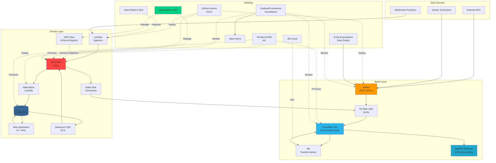
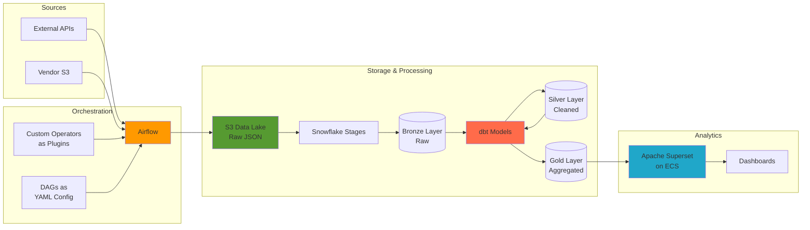
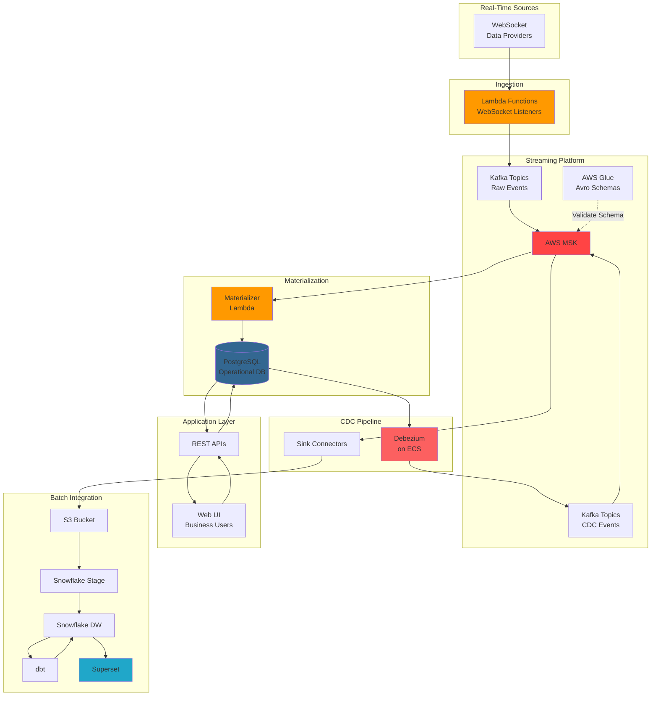
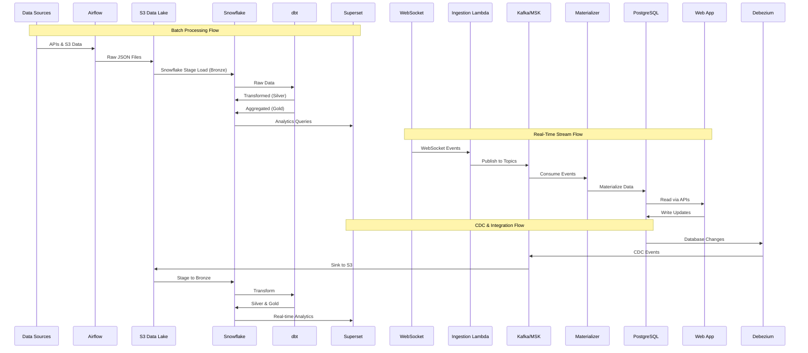

# Data Engineering Architecture

## Overview

This document outlines a comprehensive data engineering architecture that supports both batch and stream processing workloads, with robust DataOps practices. The architecture leverages modern cloud-native technologies to enable scalable, reliable, and maintainable data pipelines.

## High-Level Architecture Diagram



---

## Architecture Layers

### 1. Batch Layer

The batch layer handles large-scale data ingestion, transformation, and analytics workloads on a scheduled basis.



#### 1.1 Data Ingestion

**Orchestration: Apache Airflow**
- **Purpose**: Workflow orchestration and scheduling for batch data pipelines
- **Components**:
  - DAGs to ingest data from:
    - External APIs
    - Vendor S3 buckets
  - **DAG Factory Pattern**:
    - Custom operators developed as Airflow plugins
    - DAGs defined as configuration YAML files
    - Promotes code reusability and maintainability

#### 1.2 Data Lake (Bronze Layer)

**Storage: AWS S3**
- **Format**: JSON
- **Purpose**: Raw data accumulation layer
- **Characteristics**:
  - Immutable data storage
  - Schema-on-read approach
  - Historical data preservation

#### 1.3 Data Warehouse

**Platform: Snowflake**
- **Bronze Layer**:
  - Snowflake stages configured to pull data from S3 data lake
  - Raw data ingestion with minimal transformation
- **Silver Layer**:
  - Cleaned and conformed data
  - Type casting and standardization
  - Deduplication and data quality rules applied
- **Gold Layer**:
  - Business-level aggregations
  - Denormalized for analytics performance
  - Optimized for end-user consumption

#### 1.4 Data Transformation

**Tool: dbt (Data Build Tool)**
- Models data from Bronze → Silver → Gold layers
- **Key Features**:
  - SQL-based transformations
  - Version-controlled models
  - Built-in testing framework
  - Documentation generation
  - Lineage tracking

#### 1.5 Analytics & Visualization

**Platform: Apache Superset**
- **Hosting**: AWS ECS with auto-scaling
- **Purpose**: Self-service analytics and dashboarding
- **Data Source**: Snowflake Gold layer
- **Benefits**:
  - Interactive dashboards
  - Ad-hoc query capabilities
  - Role-based access control

---

### 2. Stream Layer

The stream layer handles real-time data ingestion, processing, and delivery for low-latency use cases.



#### 2.1 Real-Time Data Ingestion

**Compute: AWS Lambda Functions**
- Pull data from data providers via WebSockets
- Publish data to Kafka topics in JSON format
- Serverless, event-driven architecture

#### 2.2 Stream Storage

**Platform: AWS MSK (Managed Streaming for Apache Kafka)**
- **Purpose**: Durable, scalable message streaming
- **Format**: JSON messages
- **Schema Management**: AWS Glue Schema Registry
  - Avro schemas for data contracts
  - Schema evolution support
  - Compatibility validation

#### 2.3 Stream Processing & Materialization

**Materializer: AWS Lambda**
- Consumes data from Kafka topics
- Sinks data into PostgreSQL database
- Transforms and denormalizes for application consumption

#### 2.4 Application Layer

**Database: PostgreSQL**
- Operational database for web application
- Optimized for transactional workloads

**Web Application**:
- Reads data via REST APIs
- Business teams modify data through UI
- Updates persisted back to PostgreSQL via APIs

#### 2.5 Change Data Capture (CDC)

**Tool: Debezium**
- **Deployment**: ECS containers
- Captures changes from PostgreSQL
- Publishes change events to Kafka topics
- Enables real-time data synchronization

#### 2.6 Stream-to-Batch Integration

**Sink Connectors**:
- Consume data from Kafka topics
- Write to S3 in Parquet/JSON format
- **Data Flow**:
  1. Kafka Topic → S3
  2. S3 → Snowflake Stage (Bronze)
  3. dbt transformations (Silver & Gold)
  4. Apache Superset for visualization

---

### 3. DataOps

The DataOps layer ensures reliable deployments, data quality, and operational observability.

```mermaid
graph TB
    subgraph "Source Control"
        GH[GitHub Repository]
        PR[Pull Requests]
    end

    subgraph "CI/CD Pipeline"
        GHA[GitHub Actions]
        TEST[Automated Tests<br/>dbt Tests]
        BUILD[Build & Deploy]
    end

    subgraph "Infrastructure as Code"
        TF[Terraform Modules]
        CDK[AWS CDK]
        PLAN[Plan & Apply]
    end

    subgraph "Data Platform Services"
        DPAPI[Data Platform API]
        SCHEMA[Schema Management]
        TOPIC[Topic Management]
        CONTRACT[Data Contracts]
        SDK[Data Platform SDK<br/>Node.js Package]
    end

    subgraph "Data Quality"
        GE[Great Expectations<br/>in Airflow]
        DBTT[dbt Tests]
        VALIDATE[Validation Checks]
    end

    subgraph "Orchestration Management"
        DBTC[dbt Cloud]
        JOBS[Scheduled Jobs]
        AF2[Airflow Deployments]
    end

    subgraph "Monitoring & Observability"
        CW[CloudWatch Logs]
        PROM[Prometheus<br/>Metrics]
        GRAF[Grafana<br/>Dashboards]
        ALERT[Alert Rules]
        SLACK[Slack Notifications]
    end

    subgraph "Target Infrastructure"
        INFRA[AWS Resources<br/>MSK, Lambda, ECS<br/>RDS, S3, Snowflake]
    end

    GH --> PR
    PR --> TEST
    TEST --> GHA
    GHA --> BUILD
    BUILD --> AF2
    BUILD --> INFRA
    
    TF --> PLAN
    CDK --> PLAN
    PLAN --> INFRA
    
    DPAPI --> SCHEMA
    DPAPI --> TOPIC
    DPAPI --> CONTRACT
    SDK -.Used by.-> GHA
    SDK -.Used by Devs.-> DPAPI
    
    GE --> VALIDATE
    DBTT --> VALIDATE
    VALIDATE -.On Failure.-> ALERT
    
    DBTC --> JOBS
    JOBS -.Execute.-> INFRA
    
    INFRA --> CW
    INFRA --> PROM
    CW --> GRAF
    PROM --> GRAF
    GRAF --> ALERT
    ALERT --> SLACK

    style GHA fill:#2088ff
    style TF fill:#7b42bc
    style DPAPI fill:#00d084
    style GE fill:#ff4b4b
    style GRAF fill:#f46800
    style PROM fill:#e6522c
    style SLACK fill:#4a154b
```



#### 3.1 CI/CD & Infrastructure as Code

**Version Control & Deployment**:
- **GitHub Actions/Workflows**:
  - Deploy Airflow DAGs and configurations
  - Automated testing and validation
  
**Infrastructure as Code**:
- **Terraform** and **AWS CDK**
- All infrastructure provisioned and managed through code
- Version-controlled infrastructure changes
- Automated deployments via CI/CD pipelines

#### 3.2 dbt Management

**Platform: dbt Cloud**
- Scheduled dbt job execution
- **CI Integration**:
  - dbt tests run automatically on pull requests
  - Prevents breaking changes from being merged
  - Validates data quality and business logic

#### 3.3 Data Platform Services

**Data Platform API**:
- **Capabilities**:
  - Avro schema management
  - Data contract enforcement
  - Kafka topic provisioning and configuration
  - Metadata management
- **Purpose**: Centralized data platform governance

**Data Platform SDK**:
- Developed in Node.js
- Distributed as GitHub package
- **Integration**: Embeddable in developer environments
- **Use Case**: Simplifies interaction with data platform for Node.js Lambda developers

#### 3.4 Data Quality

**Tool: Great Expectations**
- **Deployment**: Runs within Airflow
- **Capabilities**:
  - Data validation and profiling
  - Automated data quality checks
  - Anomaly detection
  - Data documentation

#### 3.5 Monitoring & Observability

**Logging**: AWS CloudWatch Logs
- Centralized log aggregation
- Application and infrastructure logs

**Metrics & Monitoring**:
- **Grafana**: Visualization and dashboarding
- **Prometheus**: Metrics collection and alerting
- **Alerting**: Slack channel notifications
- **Coverage**:
  - Pipeline health and performance
  - Infrastructure metrics
  - Data quality alerts
  - System anomalies

---

## Data Flow Summary

### Complete End-to-End Data Flow



### Simplified Flow Paths

**Path 1: Batch Analytics**
```
External Sources → Airflow → S3 Data Lake → Snowflake (Bronze) → dbt (Silver/Gold) → Superset
```

**Path 2: Real-Time Application**
```
WebSockets → Lambda → Kafka/MSK → Materializer → PostgreSQL → Web App
```

**Path 3: Unified Analytics (Stream + Batch)**
```
PostgreSQL → Debezium CDC → Kafka → S3 → Snowflake → dbt → Superset
```

---

## Technology Stack

| Component | Technology | Purpose |
|-----------|-----------|---------|
| Orchestration | Apache Airflow | Workflow scheduling |
| Data Lake | AWS S3 | Raw data storage |
| Data Warehouse | Snowflake | Analytics data warehouse |
| Transformation | dbt | Data modeling & transformation |
| Stream Storage | AWS MSK (Kafka) | Message streaming |
| Stream Processing | AWS Lambda | Serverless compute |
| CDC | Debezium (ECS) | Change data capture |
| Operational DB | PostgreSQL | Transactional database |
| Schema Registry | AWS Glue | Schema management (Avro) |
| Analytics | Apache Superset (ECS) | Visualization & BI |
| Data Quality | Great Expectations | Data validation |
| IaC | Terraform, AWS CDK | Infrastructure provisioning |
| CI/CD | GitHub Actions | Automated deployments |
| Monitoring | Grafana, Prometheus, CloudWatch | Observability |
| Alerting | Slack | Incident notifications |

---

## Key Design Principles

### 1. Medallion Architecture
- **Bronze**: Raw, immutable data
- **Silver**: Cleaned, conformed data
- **Gold**: Business-level aggregations

### 2. Configuration-Driven
- DAGs defined as YAML configuration
- Custom operators as reusable plugins
- Promotes standardization and reduces code duplication

### 3. Event-Driven Architecture
- Kafka as the central nervous system for real-time data
- Decoupled services communicate via events
- Enables scalability and fault tolerance

### 4. Schema Management
- Avro schemas enforce data contracts
- Centralized schema registry (AWS Glue)
- Schema evolution with compatibility checks

### 5. Infrastructure as Code
- All infrastructure defined in Terraform/CDK
- Version-controlled and reviewable
- Reproducible environments

### 6. Data Quality First
- Great Expectations for automated validation
- dbt tests in CI/CD pipeline
- Continuous monitoring and alerting

### 7. Developer Experience
- Data Platform SDK for easy integration
- Self-service via Data Platform API
- Comprehensive documentation and tooling

---

## Security Considerations

- **Authentication & Authorization**: Role-based access control across all layers
- **Data Encryption**: At-rest (S3, Snowflake) and in-transit (TLS)
- **Network Security**: VPC isolation, security groups, private subnets
- **Secret Management**: AWS Secrets Manager for credentials
- **Audit Logging**: Comprehensive logging for compliance

---

## Scalability & Resilience

- **Auto-scaling**: ECS services (Superset, Debezium)
- **Serverless**: Lambda functions scale automatically
- **Managed Services**: MSK, Snowflake, RDS handle scaling
- **Fault Tolerance**: Kafka replication, database backups
- **Monitoring**: Proactive alerting prevents incidents

---

## Future Enhancements

- **Data Catalog**: AWS Glue or Apache Atlas for metadata management
- **ML Pipelines**: Integration with SageMaker or MLflow
- **Data Governance**: Apache Ranger or Snowflake governance features
- **Cost Optimization**: Automated resource tagging and cost allocation
- **Multi-Region**: DR and compliance requirements

---

*Document Version: 1.0*  
*Last Updated: January 4, 2026*

